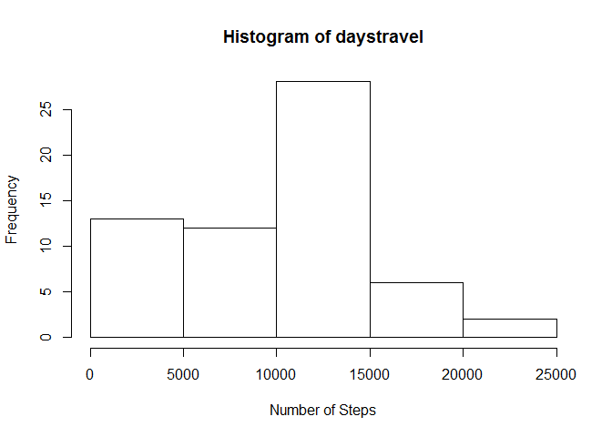
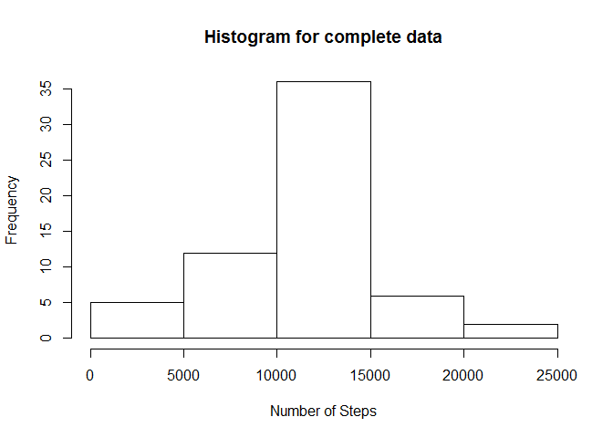
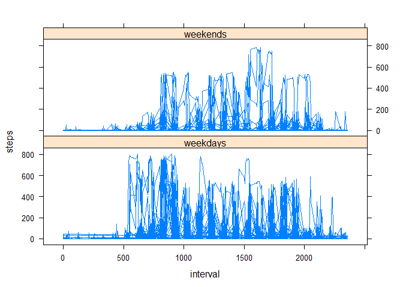

# Reproducible Research: Peer Assessment 1


## Loading and preprocessing the data
  It is presumed that data is present in present working directory after being extracted from the zip file.


```r
  data<-read.csv("activity.csv")
  data<-transform(data,as.Date(date))
  data2<-split(data, data$date)
```

## What is mean total number of steps taken per day?
 Following code gives the mean and median of number of steps taken per day and also plots its histogram.
  While a bar plot is used to represent frequency for discrete data(i.e. frequency of each distinct reading of the data), histogram shows the frequency of a range of values.  


```r
  daystravel<-sapply(data2,function(x)return (sum(x$steps, na.rm = TRUE)))
  meanvalue<-sapply(data2, function(x)return(mean(x$steps,na.rm = TRUE)))
  medianvalue<-sapply(data2, function(x)return(median(x$steps,na.rm = TRUE)))
  hist(daystravel,xlab = "Number of Steps")
```

 

```r
  mean<-mean(daystravel)
  median<-median(daystravel)
  print(paste("Mean and median of the total number of steps taken per day are",mean,"and",median,"respectively", sep = " "))
```

```
## [1] "Mean and median of the total number of steps taken per day are 9354.22950819672 and 10395 respectively"
```


## What is the average daily activity pattern?
 It is observed that number of steps is higher in afternoon and evening hours than night and early morning hours.


```r
  data3<-split(data,data$interval)
  data4<-sapply(data3,function(x)return (mean(x$steps, na.rm = TRUE)))
  intervals<-levels(as.factor(data$interval))
  plot(intervals,data4,type = "l",xlab = "5-minute interval",ylab= "Average number of steps")
```

 

```r
  tmaxsteps<-as.vector(intervals[which.max(data4)])
  print(paste("Interval with maximum average number of steps is",tmaxsteps, "-" ,as.numeric(tmaxsteps)+5))
```

```
## [1] "Interval with maximum average number of steps is 835 - 840"
```


## Imputing missing values
Missing values for step data for 5-minute intervals is replaced by mean of steps taken in that period, as calculated previously and stored in variable data4. 


```r
  data5<-data4
  data5<-data.frame(data5)
  data5$interval<-levels(factor(data$interval))
  names(data5)[1]<-"steps"
  num<-sum(is.na(data[,1]))
  print(paste("There are",num,"missing values in data",sep = " "))
```

```
## [1] "There are 2304 missing values in data"
```

```r
  newdata<-data
  for(i in 1:nrow(newdata))
  {
    if(is.na(newdata[i,]$steps)){
      newdata[i,]$steps <- data5[data5$interval==newdata[i,]$interval,]$steps
    }
  }
  newdata2<-split(newdata, newdata$date)
  newdaystravel<-sapply(newdata2,function(x)return (sum(x$steps, na.rm = TRUE)))
  newmean<-mean(newdata$step)
  newmedian<-median(newdata$steps)
  hist(newdaystravel,xlab = "Number of Steps", main = "Histogram for complete data")
```

 

```r
  print(paste("Mean and median of the total number of steps taken per day for tha data obtained by replacing missing values are",newmean,"and",newmedian,"respectively",sep = " "))
```

```
## [1] "Mean and median of the total number of steps taken per day for tha data obtained by replacing missing values are 37.3825995807128 and 0 respectively"
```

## Are there differences in activity patterns between weekdays and weekends?
It is observed that during weekdays people tend to take more steps than on weekends, in early morning hours.


```r
 newdata$daytype<-rep("data unavailable",length(newdata[,1]))
    day<-weekdays(as.Date(newdata$date),abbreviate = TRUE)
  for (j in 1:length(newdata[,1])){
  
    if(day[j]=="Mon"|day[j]=="Tue"|day[j]=="Wed"|day[j]=="Thu"|day[j]=="Fri")
         newdata[j,]$daytype <- "weekdays"
    else newdata[j,]$daytype<-"weekends"
  }
  library(lattice)
  xyplot(steps~interval|daytype,data = newdata,type = "l",layout = c(1,2))
```

 

  

